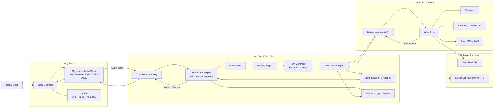
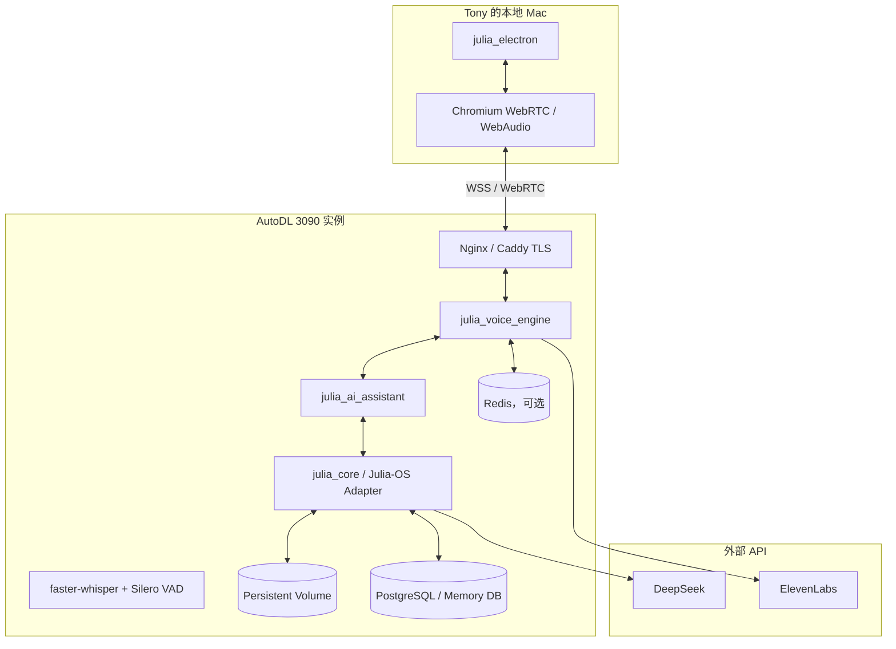
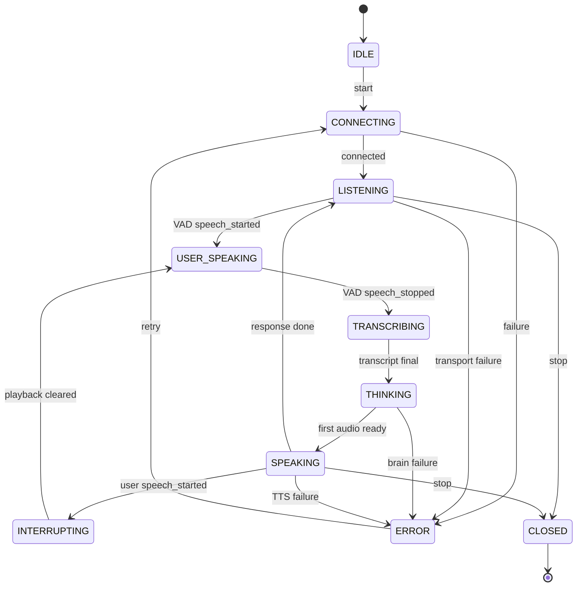
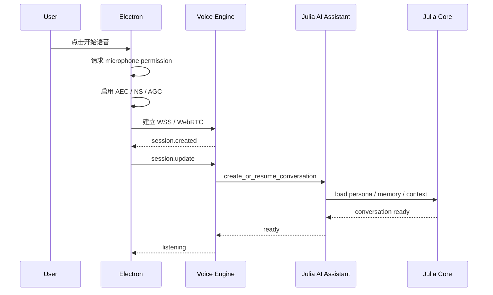
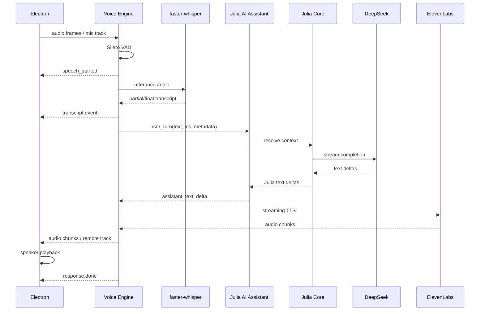
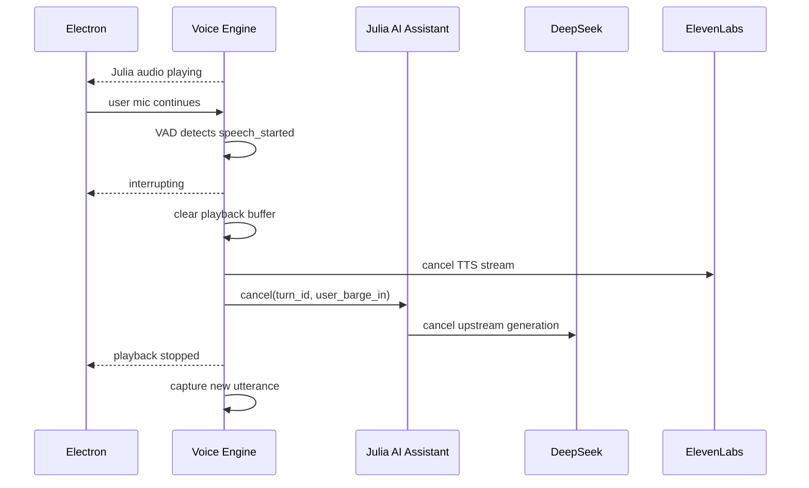
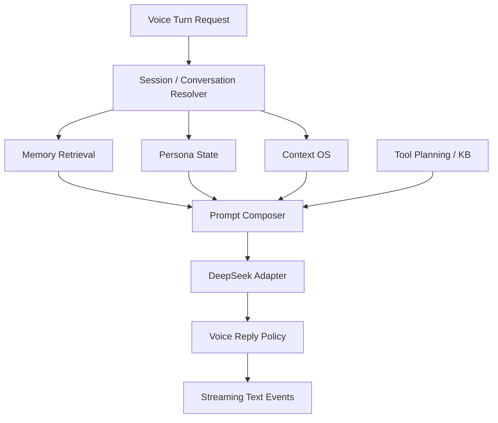

# Julia Voice Engine 与 Julia-OS 集成架构设计

> 文档版本：v1.0  
> 文档状态：Architecture Review Draft  
> 日期：2026-08-06  
> 适用项目：`julia_electron`、`Julia-AI-Assistant`、`julia_core` / Julia-OS  
> 目标平台：本地 macOS Electron + AutoDL RTX 3090 + DeepSeek + ElevenLabs  
> 作者角色：系统架构评审稿

---

## 0. 文档目的

本文用于评审 Julia 双向语音交互系统的新技术路线，重点回答以下问题：

1. 哪些组件部署在本地 Mac，哪些组件部署在 AutoDL 3090。
2. Julia Electron、Voice Engine、Julia AI Assistant、Julia Core / Julia-OS、DeepSeek 和 ElevenLabs 如何交互。
3. 用户语音、转写文本、Julia 上下文、回复文本和合成音频如何在系统中流动。
4. 回音消除、用户插话、取消、流式播放和会话状态如何实现。
5. 如何绕开已经确认不可用的 Python LiveKit `AgentSession + RoomIO` 路径。
6. 如何分阶段落地，避免再次同时引入过多变量。
7. 每个阶段如何验收，什么条件下才能冻结新基线。

---

## 1. 当前背景与已冻结状态

### 1.1 当前代码基线

| 子系统 | 基线 | 状态 |
|---|---:|---|
| Julia Core | `865ffc4` | FROZEN |
| Julia Electron | `a4aab68` | FROZEN |
| Julia AI Assistant | `3cacff6` | CLEAN BLOCKED BASELINE |

### 1.2 已确认阻塞

```text
V2-1A = BLOCKED
BLOCKED_BY_LIVEKIT_AGENTSESSION_ROOMIO_AUDIO_INTEGRATION
```

已确认的两个问题：

```text
Issue A:
LiveKit Python RoomIO progressive framing
→ 远端静音

Issue B:
RoomIO fixed 10 ms framing
→ 远端噪声
→ 进程被 SIGUSR1 终止
```

环境指纹：

```text
Python             3.12.1
livekit            1.1.14
livekit-agents     1.6.8
```

### 1.3 已排除范围

现有实验证据已经排除以下主要组件为首要根因：

- ElevenLabs REST TTS 本身；
- 单独的音频流适配器；
- LiveKit 基础 RTC / Opus / Server 转发；
- Electron 远端音轨接收；
- 普通 `AudioSource`；
- Agent `JobContext` 内的直接 `AudioSource`；
- Python 3.12 与 3.13 差异；
- HTTP session / proxy 配置。

因此，新方案不继续修补当前 Python RoomIO，也不允许将诊断性 `site-packages` 修改带入正式基线。

---

## 2. 新架构决策摘要

### 2.1 决策

采用 Hugging Face `speech-to-speech` 作为 Julia 的 Voice Engine 基底，负责：

- 音频接入；
- VAD；
- STT；
- turn-taking；
- barge-in；
- 取消；
- TTS 调度；
- 音频输出；
- WebSocket / WebRTC 实时协议。

Julia-OS 继续负责：

- Julia 人格；
- 长期记忆；
- Context OS；
- 会话上下文；
- 知识库；
- 工具调用；
- 回复策略；
- DeepSeek 调用。

DeepSeek 只承担语言模型推理。

ElevenLabs 只承担 Julia 音色的流式语音合成。

### 2.2 一句话架构

```text
本地 Electron 管耳朵、扬声器、AEC 和 UI；
AutoDL 3090 管实时语音神经系统；
Julia-OS 管人格、记忆、工具和上下文；
DeepSeek 管推理；
ElevenLabs 管 Julia 的声音。
```

### 2.3 新项目状态

```text
V2-1A:
LiveKit Python AgentSession + RoomIO
STATUS: BLOCKED / ARCHIVED INVESTIGATION

V2-1B:
HF speech-to-speech + Julia-OS + DeepSeek + ElevenLabs
STATUS: ACTIVE ARCHITECTURE CANDIDATE
```

---

## 3. 设计目标与非目标

### 3.1 设计目标

1. Julia 可以在 Electron 中进行中文语音对话。
2. 用户语音能够被准确识别。
3. Julia 回复使用现有 DeepSeek 和 Julia-OS。
4. Julia 使用既定 ElevenLabs 声线。
5. 支持服务端 VAD 和用户插话。
6. 外放模式下尽量避免 Julia 听见自己的声音。
7. 音频故障不污染 Julia Core。
8. Voice Engine 可独立替换。
9. Julia 的人格与记忆不绑定任何语音供应商。
10. 形成可以持续回归测试的正式媒体基线。

### 3.2 第一阶段非目标

第一阶段不同时追求：

- 数字人口型同步；
- 多人房间；
- 电话网关；
- 移动端；
- 完美公网 WebRTC 穿透；
- 极限低于 300 ms 首响；
- 本地运行 DeepSeek；
- 本地运行 Qwen LLM；
- 复杂多语种自动切换；
- LiveKit AgentSession 兼容修复。

---

## 4. 总体逻辑架构



---

## 5. 推荐物理部署拓扑

### 5.1 推荐正式部署



### 5.2 为什么推荐 Julia-OS 与 Voice Engine 同处 AutoDL

正式版建议将以下运行时部署到 AutoDL 同一实例或同一内网：

- `julia_voice_engine`
- `Julia-AI-Assistant`
- `julia_core` runtime adapter

原因：

1. Voice Engine 到 Julia-OS 之间不再经过公网往返。
2. 降低 STT 完成到 LLM 请求开始之间的延迟。
3. 取消信号可以快速到达 Julia-OS。
4. 避免 AutoDL 主动访问本地 Mac 服务所需的 NAT 穿透。
5. 服务日志、trace 和 session ID 更容易统一。
6. Electron 断线不会导致 Julia Core 进程丢失。

### 5.3 过渡部署

如果 Julia-OS 当前只能在 Mac 本地运行，可使用过渡方案：

```text
AutoDL Voice Engine
→ HTTPS / WSS secure tunnel
→ 本地 Julia AI Assistant
→ Julia Core
```

可用方式：

- Tailscale；
- Cloudflare Tunnel；
- WireGuard；
- 受控反向隧道。

该模式只用于早期验证，不建议作为最终正式拓扑，因为它增加：

- 往返延迟；
- 本地 Mac 在线依赖；
- 隧道故障点；
- 安全配置复杂度；
- AutoDL 到本地服务的可达性问题。

---

## 6. 部署组件清单

### 6.1 本地 Mac

| 组件 | 项目归属 | 职责 |
|---|---|---|
| Julia Electron | `julia_electron` | 界面、会话控制、字幕、音频设备 |
| Chromium Audio | Electron Runtime | 麦克风、扬声器、AEC、降噪、AGC |
| Voice Transport Client | `julia_electron` | WSS 或 WebRTC 连接 |
| Local State Store | `julia_electron` | UI 状态、设备选择、用户偏好 |

本地禁止部署：

- Whisper；
- VAD Server；
- ElevenLabs Key；
- DeepSeek Key；
- Julia Core 的媒体处理代码；
- 自定义 PCM→LiveKit track；
- Python RoomIO。

### 6.2 AutoDL 3090

| 组件 | 建议进程 | 职责 |
|---|---|---|
| TLS Gateway | Nginx/Caddy | HTTPS/WSS、鉴权、限流 |
| Voice Engine | `julia_voice_engine` | 实时音频编排 |
| Silero VAD | Voice Engine 内 | 开始/结束说话检测 |
| faster-whisper | Voice Engine 内 | 中文 STT |
| Turn Controller | Voice Engine 内 | 轮次、插话、取消 |
| ElevenLabs Adapter | Voice Engine 内 | 文本流转 ElevenLabs 音频流 |
| Brain Adapter | Voice Engine 内 | Julia-OS 请求与流式回复 |
| Julia AI Assistant | 独立服务 | OpenAI-compatible 内部接口 |
| Julia Core | 独立库/服务 | 人格、记忆、Context OS |
| Redis | 可选 | session、取消、短期状态 |
| PostgreSQL | 推荐 | 记忆、会话、审计数据 |
| Observability | 推荐 | metrics、trace、结构化日志 |

### 6.3 外部服务

| 服务 | 作用 | 秘钥位置 |
|---|---|---|
| DeepSeek API | 文本推理 | AutoDL server env / secret |
| ElevenLabs API | Julia 声音合成 | AutoDL server env / secret |

任何 API Key 都不能进入 Electron bundle。

---

## 7. 组件边界

### 7.1 Julia Electron

允许：

- `getUserMedia`
- `RTCPeerConnection`
- WebSocket
- AudioWorklet
- 远端音频播放
- 音频设备选择
- AEC / NS / AGC 设置
- UI 状态机

禁止：

- 本地 STT 绕过 Voice Engine；
- REST TTS 下载 MP3 直接播放；
- 自己实现服务器 VAD；
- 自己调用 DeepSeek；
- 自己访问 ElevenLabs Key；
- 维护 Julia 人格或长期记忆。

### 7.2 Voice Engine

允许：

- PCM / Opus；
- WebSocket / WebRTC；
- VAD；
- STT；
- TTS；
- 播放队列；
- barge-in；
- response cancel；
- 音频缓冲；
- 实时会话状态。

禁止：

- Julia 人格决策；
- 长期记忆业务逻辑；
- 直接改写 Julia 的核心提示词；
- 绕开 Julia Core 直接生成正式回答。

### 7.3 Julia AI Assistant

允许：

- 对 Voice Engine 提供统一文本接口；
- conversation/session mapping；
- 流式回复；
- cancellation；
- tools；
- Julia Core adapter；
- DeepSeek provider adapter。

禁止：

- PCM；
- Opus；
- `AudioFrame`；
- WebRTC media track；
- 麦克风；
- 播放器；
- AEC；
- RoomIO。

### 7.4 Julia Core / Julia-OS

只处理语义层：

- 用户文本；
- 会话上下文；
- 人格；
- 记忆；
- 情绪状态；
- 知识库；
- 工具；
- 回复策略；
- 结构化语义事件。

Julia Core 永远不处理原始音频。

---

## 8. 传输路线

### 8.1 阶段一：WebSocket 基线

```text
Electron
↔ WSS
↔ Voice Engine
```

上行：

```text
48 kHz Float32 microphone
→ Browser AudioWorklet
→ 16 kHz PCM16 mono
→ input_audio_buffer.append
```

下行：

```text
ElevenLabs audio
→ Voice Engine normalization
→ 24/48 kHz PCM chunks
→ response.output_audio.delta
→ Browser playback AudioWorklet
```

优点：

- AutoDL TCP 映射容易；
- 日志可读；
- 抓包容易；
- 可独立测试每一帧；
- 第一阶段最适合诊断。

局限：

- WebSocket 音频和播放不是原生单一 WebRTC RTP 链；
- 浏览器 AEC 仍可请求，但外放双讲效果必须实测；
- 真正 barge-in 需要客户端播放队列和服务端取消配合。

### 8.2 阶段二：WebRTC 目标链路

```text
Electron RTCPeerConnection
├── Mic Track: Opus RTP → Voice Engine
├── Remote Track: Voice Engine → Electron Speaker
└── DataChannel: JSON events
```

优点：

- 麦克风和远端音频处在同一 WebRTC 会话；
- 更符合浏览器 AEC 的典型工作模型；
- 远端音轨直接播放；
- 服务端可以直接停止远端音频发送；
- 更适合真正全双工与插话。

网络要求：

- SDP handshake；
- ICE；
- STUN；
- 公网部署可能需要 TURN；
- AutoDL 是否支持所需 UDP 映射必须实测；
- 若 UDP 受限，考虑 TURN/TLS 443 或 WebRTC over TCP relay。

### 8.3 评审结论

```text
WebSocket = 第一阶段功能与稳定性基线
WebRTC   = 第二阶段正式 AEC / barge-in 目标
```

不能把“WebSocket 跑通”直接定义为“外放全双工 AEC 已通过”。

---

## 9. 回音消除设计

### 9.1 AEC 所在位置

AEC 必须位于本地 Electron / Chromium 音频采集端。


### 9.2 麦克风约束

Electron 采集必须显式请求：

```javascript
const stream = await navigator.mediaDevices.getUserMedia({
  audio: {
    echoCancellation: true,
    noiseSuppression: true,
    autoGainControl: true,
    channelCount: 1,
  },
});
```

采集后必须记录实际设置：

```javascript
const track = stream.getAudioTracks()[0];
const settings = track.getSettings();

console.info({
  echoCancellation: settings.echoCancellation,
  noiseSuppression: settings.noiseSuppression,
  autoGainControl: settings.autoGainControl,
  sampleRate: settings.sampleRate,
  channelCount: settings.channelCount,
});
```

验收不能只看请求参数，必须看：

- `getSettings()`；
- 远端播放时 STT 是否识别出 Julia 自己；
- 双讲时 Tony 的语音是否仍可识别；
- 扬声器音量变化对回声残留的影响。

### 9.3 客户端媒体所有权原则

允许后端拆分，但本地媒体所有权必须统一。

正确：

```text
同一个 Electron 音频客户端
├── 采集麦克风
└── 播放 Voice Engine 返回的 Julia 音频
```

错误：

```text
麦克风由 Voice Engine SDK 采集
Julia 音频由另一个 REST MP3 播放器播放
```

错误：

```text
麦克风走 WebRTC
TTS 通过独立 HTMLAudio 下载链接播放
```

错误：

```text
一套 SDK 采麦克风
另一套 SDK 播远端音频
```

### 9.4 AEC 降级策略

如果阶段一 WebSocket 外放模式下 AEC 不稳定，提供两级降级：

#### 降级 A：半双工保护

```text
Julia 播放开始
→ 暂停上传麦克风帧

Julia 播放结束
→ 恢复上传麦克风帧
```

优点：稳定，不会自我触发。  
缺点：不能插话。

#### 降级 B：耳机模式

开发与基线测试可先用耳机排除声学回路，但耳机不能替代正式外放验收。

---

## 10. 会话状态机

### 10.1 Voice Session 状态



### 10.2 状态所有权

| 状态 | 权威组件 |
|---|---|
| transport connected | Voice Engine |
| user speaking | Server VAD |
| transcript final | STT |
| Julia thinking | Brain Adapter |
| Julia speaking | Voice Engine actual audio output |
| interrupted | Turn Controller |
| response cancelled | Julia AI Assistant + Voice Engine |
| UI state | Electron 映射服务端状态 |

Electron 不自行猜测核心语义状态，只根据权威事件更新 UI。

---

## 11. 端到端数据流

### 11.1 会话建立



### 11.2 用户说话到 Julia 回复



### 11.3 用户插话



---

## 12. Julia-OS 交互协议

### 12.1 ID 体系

必须统一以下 ID：

| 字段 | 作用 |
|---|---|
| `voice_session_id` | 一次实时音频连接 |
| `conversation_id` | Julia 长期会话 |
| `turn_id` | 一轮用户输入与 Julia 回复 |
| `response_id` | 一次模型生成与 TTS 输出 |
| `participant_id` | Electron 用户身份 |
| `trace_id` | 全链路观测 |

### 12.2 Voice Engine → Julia-OS

推荐内部接口：

```http
POST /internal/v1/voice/turns
Authorization: Bearer <internal-token>
Content-Type: application/json
Accept: text/event-stream
```

请求：

```json
{
  "voice_session_id": "vs_01J...",
  "conversation_id": "conv_tony_julia",
  "turn_id": "turn_000123",
  "participant_id": "tony",
  "input_mode": "voice",
  "language": "zh-CN",
  "user_text": "Julia，你还记得我们昨天讨论的语音架构吗？",
  "timestamps": {
    "speech_started_at": 1786000000.100,
    "speech_stopped_at": 1786000002.520,
    "transcript_final_at": 1786000002.810
  },
  "voice_context": {
    "transport": "websocket",
    "is_barge_in": false,
    "stt_confidence": 0.94
  },
  "client_context": {
    "platform": "darwin",
    "app_version": "2.1.0",
    "audio_output": "speaker"
  }
}
```

### 12.3 Julia-OS → Voice Engine 流式事件

SSE 示例：

```text
event: response.created
data: {"turn_id":"turn_000123","response_id":"resp_000123"}

event: assistant.text.delta
data: {"response_id":"resp_000123","seq":1,"text":"当然记得，"}

event: assistant.text.delta
data: {"response_id":"resp_000123","seq":2,"text":"我们昨天把语音引擎和 Julia-OS 的边界重新整理了。"}

event: assistant.text.done
data: {"response_id":"resp_000123"}

event: response.done
data: {"response_id":"resp_000123","status":"completed"}
```

### 12.4 取消接口

```http
POST /internal/v1/voice/responses/{response_id}/cancel
```

请求：

```json
{
  "voice_session_id": "vs_01J...",
  "turn_id": "turn_000123",
  "reason": "user_barge_in",
  "cancelled_at": 1786000003.220
}
```

响应：

```json
{
  "response_id": "resp_000123",
  "status": "cancelling"
}
```

取消必须向下传播：

```text
Voice Engine
→ Julia AI Assistant
→ Julia Core generation scope
→ DeepSeek HTTP stream
```

---

## 13. Julia Core 内部数据流



### 13.1 Voice Reply Policy

语音回复与文字回复应采用不同输出策略：

- 默认 1～3 句；
- 避免 Markdown；
- 避免列表符号；
- 避免长 URL；
- 数字与缩写进行 TTS 友好转换；
- 句子应尽快形成可合成片段；
- 不等待整段完成才进入 TTS；
- 情绪标签作为结构化元数据传递，不混入正文；
- 允许在插话时安全取消。

建议 Julia Core 输出：

```json
{
  "type": "assistant_text_delta",
  "text": "当然记得，",
  "voice": {
    "emotion": "warm",
    "pace": "normal",
    "interruptible": true
  }
}
```

---

## 14. ElevenLabs TTS Adapter

### 14.1 职责

- 接收 Julia 文本 delta；
- 进行文本缓冲和分句；
- 调 ElevenLabs streaming TTS；
- 接收音频 chunk；
- 转换为 Voice Engine 统一音频格式；
- 支持 cancel；
- 产生 TTS metrics。

### 14.2 不承担

- VAD；
- STT；
- AEC；
- 用户插话判定；
- Julia 人格；
- 长期记忆；
- WebRTC signaling；
- Electron 播放。

### 14.3 文本切片策略

不建议每个 token 都发送 TTS。

推荐：

```text
LLM token stream
→ sentence buffer
→ 遇到标点或达到阈值
→ 提交一个 TTS segment
```

参考阈值：

- 最小 8～12 个中文字；
- 逗号可作为软边界；
- 句号、问号、感叹号作为强边界；
- 最大等待时间 250～400 ms；
- 最大 segment 长度 40～60 个中文字。

### 14.4 音频规范

Voice Engine 内部必须冻结统一格式，例如：

```text
PCM signed 16-bit little-endian
sample_rate = 24000 or 48000
channels = 1
frame_duration = 10 ms or engine-native contract
```

不得在没有端到端验证的情况下随意使用 progressive 变长 framing。

---

## 15. STT 与 VAD

### 15.1 STT

推荐初始配置：

```text
Engine: faster-whisper
Model: large-v3 / distil-large-v3
Language: zh
Device: CUDA
Compute: float16
```

评审时需要基准：

- 实时系数；
- 首个 partial 延迟；
- final transcript 延迟；
- 中文标点质量；
- 人名 Julia / Tony 识别；
- 中英混合识别；
- 噪声环境表现。

### 15.2 VAD

推荐使用 Silero VAD。

初始参数不应直接照搬教程，应通过录音集校准：

| 参数 | 初始建议 | 作用 |
|---|---:|---|
| threshold | 0.55～0.65 | 人声判定 |
| min_speech_ms | 250～500 | 过滤短噪声 |
| min_silence_ms | 700～1200 | 中文停顿结束判断 |
| speech_pad_ms | 200～300 | 防止吃掉句首句尾 |

### 15.3 VAD 与 AEC 的关系

VAD 不能替代 AEC。

```text
AEC：去掉扬声器回灌
VAD：判断剩余信号是否有人说话
STT：识别内容
```

如果 AEC 失败，VAD 很可能将 Julia 自己的声音识别为新一轮用户输入。

---

## 16. 安全设计

### 16.1 秘钥

AutoDL Secret / environment：

- `DEEPSEEK_API_KEY`
- `ELEVENLABS_API_KEY`
- `JULIA_INTERNAL_TOKEN`
- 数据库密码
- TLS private key

Electron 不得包含任何供应商 API Key。

### 16.2 客户端鉴权

推荐流程：

```text
Electron
→ POST /api/voice/session
→ Gateway 验证本地用户
→ 返回短期 voice token
→ Electron 建立 WSS / WebRTC
```

短期 token 应包含：

- user ID；
- session ID；
- expires at；
- allowed transport；
- allowed room/session；
- nonce。

### 16.3 内部服务鉴权

Voice Engine → Julia AI Assistant：

```text
mTLS
或
private network + rotating bearer token
```

### 16.4 日志脱敏

禁止记录：

- API Key；
- Authorization header；
- 完整代理 URL；
- 原始长期语音；
- 敏感记忆全文；
- 用户私人数据库字段。

允许记录：

- key configured: true/false；
- audio duration；
- RMS；
- sample rate；
- chunk count；
- model latency；
- turn ID；
- error code。

---

## 17. 可观测性

### 17.1 核心指标

#### Transport

- connection success rate；
- reconnect count；
- RTT；
- packet loss（WebRTC）；
- WS send queue depth；
- ICE state。

#### Audio

- input sample rate；
- output sample rate；
- input RMS；
- output RMS；
- dropped frames；
- playback underrun；
- TTS buffer depth；
- echo-trigger count。

#### VAD / STT

- speech start latency；
- utterance duration；
- transcript latency；
- confidence；
- empty transcript rate；
- false start rate。

#### Julia-OS

- context load latency；
- memory retrieval latency；
- DeepSeek first-token latency；
- tool latency；
- cancellation latency。

#### TTS

- request latency；
- first audio latency；
- real-time factor；
- chunk jitter；
- cancellation latency；
- provider error rate。

### 17.2 端到端时延拆分

每个 turn 至少记录：

```text
t0 user speech started
t1 user speech stopped
t2 transcript final
t3 Julia request started
t4 DeepSeek first token
t5 first TTS segment submitted
t6 first audio received
t7 first audio played
t8 response completed
```

核心指标：

```text
STT latency       = t2 - t1
Brain latency     = t4 - t3
TTS first audio   = t6 - t5
End-to-end first response = t7 - t1
```

---

## 18. 故障隔离与降级

### 18.1 STT 失败

行为：

- 不创建空 Julia turn；
- UI 显示“没听清”；
- 保持 listening；
- 可播放短提示音，但不调用 DeepSeek。

### 18.2 DeepSeek 失败

行为：

- 终止 response；
- Julia Core 返回本地 fallback 文本；
- 不泄露供应商错误；
- 记录 provider code。

### 18.3 ElevenLabs 失败

行为：

- 保留文字回复；
- 可切换备用 TTS；
- 标记 voice degraded；
- 不影响 Julia 会话记忆。

### 18.4 AutoDL 断线

行为：

- Electron 切换 disconnected；
- 停止麦克风；
- 清空播放队列；
- 指数退避重连；
- conversation ID 保留，voice session ID 重建。

### 18.5 AEC 失败

检测信号：

- Julia 播放期间出现与输出高度相似的 STT；
- 远端说话内容反复触发新 turn；
- output RMS 与 mic RMS 高相关。

降级：

1. 切换半双工；
2. 提示使用耳机；
3. 降低扬声器音量；
4. 暂停 barge-in；
5. 继续保留文字交互。

---

## 19. 代码仓库建议

### 19.1 新仓库或新模块

建议建立独立仓库：

```text
julia_voice_engine/
├── app/
│   ├── server.py
│   ├── config.py
│   ├── session_manager.py
│   ├── turn_controller.py
│   ├── brain_adapter.py
│   ├── elevenlabs_tts.py
│   ├── audio_contracts.py
│   ├── events.py
│   ├── metrics.py
│   └── security.py
├── tests/
│   ├── unit/
│   ├── integration/
│   ├── audio_fixtures/
│   └── e2e/
├── deploy/
│   ├── Dockerfile
│   ├── docker-compose.yml
│   ├── nginx.conf
│   └── systemd/
├── scripts/
│   ├── smoke_ws.py
│   ├── smoke_webrtc.py
│   ├── test_aec.py
│   └── benchmark_latency.py
├── docs/
│   ├── ADR-001-voice-engine.md
│   ├── protocols.md
│   └── runbook.md
├── pyproject.toml
└── README.md
```

### 19.2 现有仓库改动边界

#### `julia_electron`

增加：

- VoiceEngineClient；
- audio device settings；
- voice session state；
- AEC actual settings logging；
- transcript UI；
- reconnect；
- barge-in UI。

不增加：

- DeepSeek；
- ElevenLabs Key；
- Python media；
- local STT。

#### `Julia-AI-Assistant`

增加：

- `/internal/v1/voice/turns`；
- SSE streaming；
- cancel endpoint；
- voice reply policy；
- JuliaCoreAdapter；
- trace ID propagation。

不增加：

- PCM；
- Opus；
- RTC Track；
- AudioSource。

#### `julia_core`

增加或复用：

- voice context semantic fields；
- interruptible response metadata；
- concise spoken-output policy。

不增加任何媒体依赖。

---

## 20. 分阶段实施计划

### Phase 0：仓库与环境隔离

目标：

- 新建 `julia_voice_engine`；
- 不修改冻结基线；
- AutoDL 创建全新 Python 环境；
- 记录 CUDA、driver、PyTorch、Python fingerprint。

验收：

```text
新项目可独立启动
冻结仓库无改动
site-packages 无手工 patch
```

### Phase 1：官方 HF Voice Engine 原样跑通

配置：

```text
STT: 官方支持模型
LLM: 临时简单 OpenAI-compatible endpoint
TTS: 官方内置 TTS
Transport: WebSocket
Client: 官方 demo
```

验收：

- 中文 mic 输入；
- 正确 transcript；
- 可听见 TTS；
- 连续 20 轮；
- 无崩溃、静音、噪声。

### Phase 2：接 Julia AI Assistant / DeepSeek

替换 LLM endpoint：

```text
HF Voice Engine
→ Julia AI Assistant
→ Julia Core
→ DeepSeek
```

验收：

- Persona 正确；
- Memory 正确；
- 文本流；
- 取消正常；
- 不绕过 Julia Core。

### Phase 3：接 ElevenLabs

新增 TTS Adapter。

验收：

- Julia 声音正确；
- 首包时延可测；
- 连续 20 次；
- cancel 不残留旧音频；
- 不存在跨 turn 音频串线。

### Phase 4：接 Julia Electron

Electron 替换官方 demo。

验收：

- 麦克风设置正确；
- 实际 AEC setting 可见；
- 字幕正确；
- 播放正常；
- 断线重连正常。

### Phase 5：WebSocket 外放 AEC 评测

测试矩阵：

- 耳机；
- Mac 内置扬声器；
- 低/中/高音量；
- 安静房间；
- 背景音乐；
- Julia 播放期间 Tony 插话。

结论分类：

```text
PASS
PASS_WITH_LIMITATIONS
FAIL_REQUIRES_WEBRTC
```

### Phase 6：WebRTC + TURN

仅在 Phase 1～5 稳定后启动。

验收：

- Electron 与 AutoDL WebRTC 连通；
- 远端 audio track；
- DataChannel；
- 公网重连；
- AEC；
- barge-in；
- 连续 30 分钟。

### Phase 7：冻结 V2-1B

冻结前必须满足：

- 无诊断 patch；
- exact commit SHA；
- requirements lock；
- AutoDL image fingerprint；
- 20/50 轮稳定性报告；
- 外放 AEC 报告；
- cancel 测试；
- 安全检查；
- 运维 runbook。

---

## 21. 验收标准

### 21.1 基础功能

- Electron 能建立语音会话；
- 中文 STT 正确；
- Julia Core 被实际调用；
- DeepSeek 回复经 Julia Core 输出；
- ElevenLabs 声音可听；
- 文字字幕与声音对应。

### 21.2 稳定性

- 连续 50 轮；
- 30 分钟会话；
- 无进程退出；
- 无持续噪声；
- 无静音 turn；
- 无音频跨 turn 串流；
- 断线可恢复。

### 21.3 AEC

外放模式：

- Julia 语音不应形成新的完整用户 turn；
- Tony 在 Julia 播放期间说话时，STT 应识别 Tony；
- 双讲误识别率在可接受范围；
- AEC 失败时可自动或手动降级。

### 21.4 Barge-in

- VAD 检测用户插话；
- 本地播放快速停止；
- TTS stream 被取消；
- DeepSeek stream 被取消；
- 新 turn 不混入旧 turn 文本；
- 旧音频不在新 turn 恢复播放。

### 21.5 安全

- Electron bundle 无 API Key；
- 日志无明文 secret；
- 内部接口有鉴权；
- session token 短期有效；
- AutoDL 端口最小暴露。

---

## 22. 主要风险

| 风险 | 影响 | 缓解 |
|---|---|---|
| AutoDL UDP 不可用 | WebRTC 失败 | TURN/TLS 443；先 WS |
| WebSocket AEC 不稳定 | 自我回声 | 半双工；升级 WebRTC |
| ElevenLabs 网络抖动 | 首响延迟 | 文本分段；缓冲；备用 TTS |
| STT 误识别 Julia 回声 | 自循环 | AEC；相似度检测；播放期保护 |
| Julia-OS 与 AutoDL 跨公网 | 高延迟 | 同机部署或内网 |
| 3090 实例重启数据丢失 | 记忆丢失 | 持久卷与外部 DB |
| 取消链不完整 | 旧回答串入新 turn | response_id + cancel propagation |
| 引擎版本更新回归 | 音频异常 | lockfile + image + E2E fixtures |

---

## 23. 架构评审待确认项

评审需要最终确认以下决策：

1. Julia AI Assistant 和 Julia Core 是否正式部署到 AutoDL。
2. Julia Memory DB 是否迁移到云端持久存储。
3. 第一阶段是否接受 WebSocket + 半双工降级。
4. ElevenLabs 是否作为第一阶段正式 TTS，还是先使用内置 TTS 做隔离验证。
5. AutoDL 是否能开放 WebRTC 所需 UDP，或是否需要 TURN。
6. 是否建立独立 `julia_voice_engine` 仓库。
7. Voice Engine 与 Julia AI Assistant 使用 SSE 还是 WebSocket。
8. 是否将 `conversation_id` 作为跨设备永久标识。
9. AEC 外放测试的通过阈值。
10. V2-1B 冻结所需轮次与持续时长。

---

## 24. 推荐评审结论

建议批准以下方案作为 V2-1B 实施基线：

```text
Local Mac:
  julia_electron
  Chromium mic / speaker / AEC / NS / AGC

AutoDL RTX 3090:
  HF speech-to-speech Voice Engine
  Silero VAD
  faster-whisper
  Julia Brain Adapter
  ElevenLabs TTS Adapter
  Julia AI Assistant
  Julia Core runtime
  Redis / PostgreSQL / persistent storage

External:
  DeepSeek API
  ElevenLabs API
```

推荐实施顺序：

```text
官方 HF demo
→ Julia AI Assistant + DeepSeek
→ ElevenLabs
→ Electron
→ WebSocket AEC 评测
→ WebRTC/TURN
→ 正式冻结
```

推荐继续保持：

```text
Julia Core:         865ffc4 FROZEN
Julia Electron:     a4aab68 FROZEN
Julia AI Assistant: 3cacff6 CLEAN BLOCKED BASELINE
```

所有 V2-1B 开发应在新分支或新仓库进行。

---

## 25. 参考项目与技术资料

- Hugging Face `speech-to-speech`  
  <https://github.com/huggingface/speech-to-speech>

- Hugging Face speech-to-speech realtime demo  
  <https://github.com/huggingface/speech-to-speech/tree/main/demo>

- DeepSeek API Documentation  
  <https://api-docs.deepseek.com/>

- ElevenLabs Documentation  
  <https://elevenlabs.io/docs>

- WebRTC APIs / `RTCPeerConnection`  
  <https://developer.mozilla.org/docs/Web/API/RTCPeerConnection>

- Media Capture Constraints / `echoCancellation`  
  <https://developer.mozilla.org/docs/Web/API/MediaTrackConstraints/echoCancellation>

---

## Appendix A：推荐环境变量

```bash
# Voice Engine
VOICE_ENGINE_HOST=0.0.0.0
VOICE_ENGINE_PORT=8765
VOICE_TRANSPORT=websocket
VOICE_LOG_LEVEL=INFO

# STT
STT_PROVIDER=faster-whisper
STT_MODEL=large-v3
STT_LANGUAGE=zh
STT_DEVICE=cuda
STT_COMPUTE_TYPE=float16

# Julia Brain
JULIA_BRAIN_BASE_URL=http://127.0.0.1:8088
JULIA_INTERNAL_TOKEN=***
JULIA_MODEL_NAME=julia-core

# DeepSeek
DEEPSEEK_API_KEY=***
DEEPSEEK_BASE_URL=https://api.deepseek.com
DEEPSEEK_MODEL=<configured-model>

# ElevenLabs
ELEVENLABS_API_KEY=***
ELEVENLABS_VOICE_ID=***
ELEVENLABS_MODEL_ID=***

# Persistence
DATABASE_URL=postgresql://***
REDIS_URL=redis://127.0.0.1:6379/0

# WebRTC future phase
RTC_ICE_SERVERS=[...]
SPEECH_TO_SPEECH_ICE_SERVERS=[...]
```

---

## Appendix B：事件枚举建议

```text
session.created
session.ready
session.closed
session.error

input_audio.started
input_audio.stopped
input_audio.level
input_audio.echo_suspected

transcript.partial
transcript.final
transcript.failed

response.created
response.text.delta
response.text.done
response.audio.started
response.audio.delta
response.audio.done
response.cancelled
response.failed
response.done

turn.user_started
turn.user_completed
turn.assistant_started
turn.assistant_completed
turn.interrupted
```

---

## Appendix C：禁止项

以下内容不得进入 V2-1B 正式媒体路径：

```text
LiveKit Python AgentSession + RoomIO
site-packages 手工 patch
direct rtc.AudioSource production fallback
custom LiveKit LocalAudioTrack
REST MP3 download + separate player
Electron local DeepSeek key
Electron local ElevenLabs key
Julia Core PCM / Opus / WebRTC dependency
未经锁定的音频采样率转换
未经稳定性测试的 progressive frame sizing
```

---

**文档结束**
