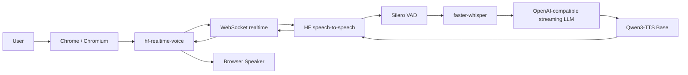
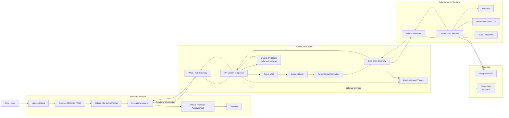
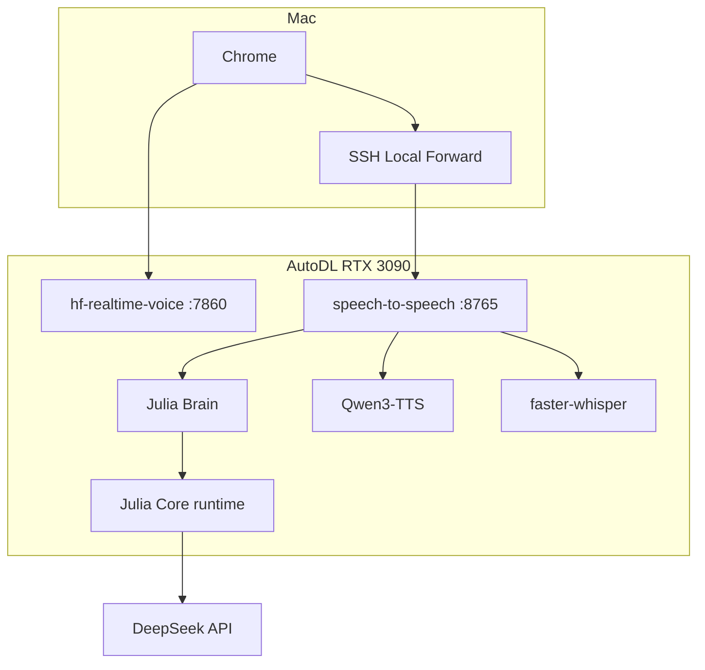
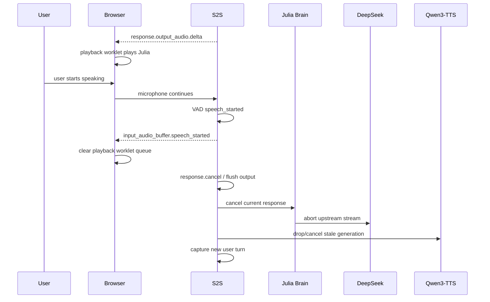
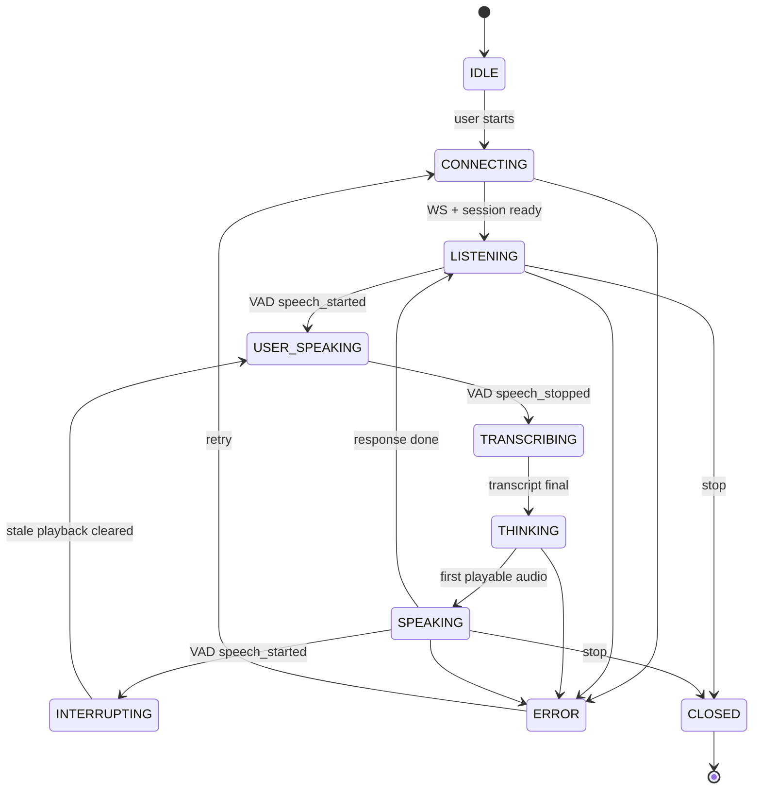
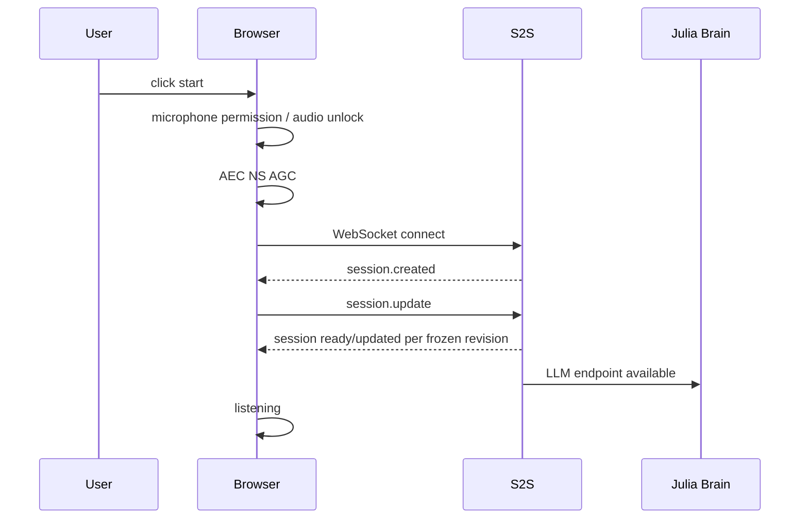
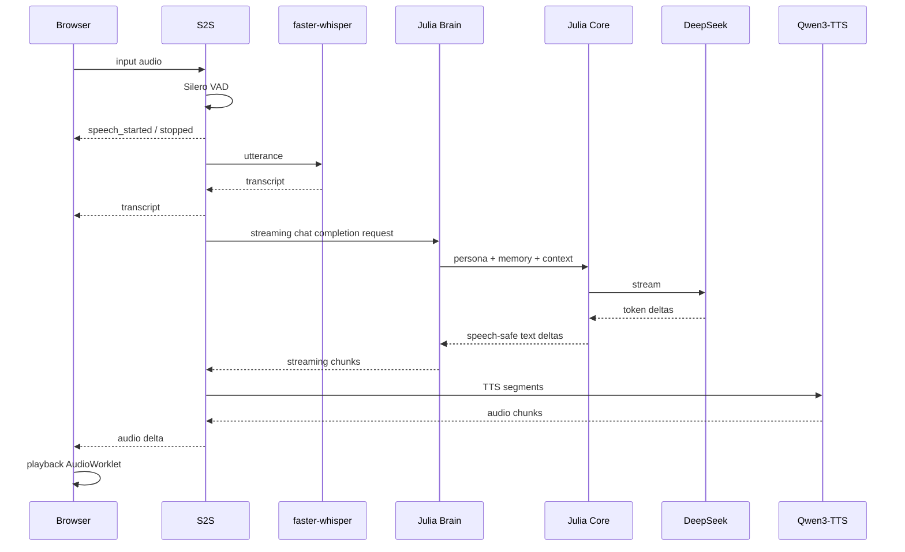

# Julia Voice Engine 与 Julia-OS 集成架构设计

> 文档版本：v2.0  
> 文档状态：Architecture Baseline Candidate / Reference-Validated Revision  
> 日期：2026-08-07  
> 适用项目：`speech-to-speech`、`hf-realtime-voice`、`Julia-AI-Assistant`、`julia_core` / Julia-OS；`julia_electron` 暂缓接入  
> 当前目标平台：标准 Chrome/Chromium 浏览器 + AutoDL RTX 3090 + DeepSeek + 本地 Qwen3-TTS  
> 可选后续平台：LiveTalking 数字人；Electron 桌面壳；WebRTC Voice  
> 作者角色：系统架构评审稿

---

## 0. 文档目的

本文是 `Julia_Voice_Engine_Architecture_Review_v1.0.md` 的正式架构修订版。

v2.0 的修订依据不是理论推演，而是基于以下已验证事实重新收敛：

1. 已获得并审阅可流畅运行的参考项目部署包：`install-voice.sh`、`start-voice.sh`、`start-livetalking.sh`、`README.txt`。
2. 参考项目的语音主链采用 Hugging Face `speech-to-speech` + `hf-realtime-voice` 浏览器前端 + WebSocket realtime transport + Silero VAD + faster-whisper + OpenAI-compatible streaming LLM + Qwen3-TTS Base voice clone。
3. 参考项目的语音交互可以实现低延迟连续对话，并支持用户插话。
4. 参考项目没有修改 `speech-to-speech` 的核心音频链。
5. 参考项目所谓“补丁”主要用于数字人页面的 `avatar-sync.js` 注入，不是对 S2S 音频 transport、VAD、STT、TTS output contract 的修改。
6. 参考项目的 **Voice 传输是 WebSocket**；WebRTC 主要用于后续 LiveTalking 数字人口型层。
7. Julia 当前实验实现同时修改了浏览器媒体客户端、S2S site-packages 和 TTS handler，偏离参考项目已经验证的 working path。
8. 因此，v2.0 的核心目标不是继续扩大自定义实现，而是把参考项目收敛成 Julia 的 **Golden Voice Baseline**，然后一次只替换一个业务组件。

本文重点回答：

1. Julia Voice MVP 到底采用什么客户端、transport、STT、TTS 和 LLM 接口。
2. 哪些媒体能力必须直接复用参考项目，哪些能力属于 Julia 自己。
3. 为什么当前自定义 `VoiceEngineClient.js`、ElevenLabs handler 和 site-packages patch 不应继续进入正式主链。
4. 如何实现标准浏览器下的持续监听、外放、AEC、barge-in 和取消。
5. Julia AI Assistant / Julia Core / DeepSeek 如何在不接触 PCM 的前提下接入。
6. 如何将本地 Qwen3-TTS voice clone 作为默认低成本方案。
7. WebRTC、Electron、ElevenLabs、数字人分别何时才允许重新进入路线。
8. 如何建立可复制、可冻结、可回归的版本与验收机制。

---

# 1. v1.0 → v2.0 决策变化摘要

## 1.1 保持不变的核心原则

以下原则继续保持：

- Hugging Face `speech-to-speech` 负责实时语音编排；
- Voice Engine 负责 VAD / STT / turn-taking / barge-in / TTS scheduling / audio output；
- Julia AI Assistant / Julia Core 只处理文本、语义、人格、记忆和工具；
- Julia Core 永远不处理 PCM / Opus / WebRTC track；
- DeepSeek 只负责语言模型推理；
- 媒体故障不得污染 Julia Core；
- 一次只能改变一个关键变量；
- 正式版本必须 exact-version freeze；
- 任何诊断性 site-packages 修改不得进入正式基线。

## 1.2 v2.0 的重大修订

| 决策项 | v1.0 | v2.0 |
|---|---|---|
| 当前正式客户端 | Electron / Chromium | **标准浏览器 + `hf-realtime-voice`** |
| Browser media | 允许自定义 VoiceEngineClient | **禁止重写官方 capture/playback path** |
| Voice transport | WS baseline，WebRTC 正式目标 | **WS = MVP/正式候选；WebRTC 按实测触发** |
| TTS Primary | ElevenLabs | **Qwen3-TTS Base 本地 voice clone** |
| ElevenLabs | 正式依赖 | **可选 premium / A-B provider** |
| S2S 修改 | 可新增 adapter | **Golden baseline 阶段核心 package 零 patch** |
| Audio playback | 客户端自定义可行 | **直接复用官方 AudioWorklet / queue** |
| LLM 接口 | Voice-specific SSE 可作为主链 | **OpenAI-compatible true streaming 为热路径** |
| Julia Brain | 允许完整回复后分片 | **必须 true streaming** |
| cancel | soft cancel 可先接受 | **正式链必须取消真实上游生成** |
| WebRTC | Phase 6 必然目标 | **只有 AEC/网络指标证明 WS 不够时才升级** |
| Electron | Phase 4 | **延期；只允许后续包装已冻结 Browser Client** |
| 数字人 | 非目标 | **独立媒体层，Voice 稳定后再接** |
| Golden baseline | 官方 demo 原样跑通 | **升级为强制不可侵犯基线 + exact pin** |

---

# 2. 当前代码与实验状态

## 2.1 已有 Julia 基线

历史架构基线：

| 子系统 | 历史参考基线 | v2.0 处理 |
|---|---:|---|
| Julia Core | `865ffc4` | 继续保持语义层冻结原则 |
| Julia Electron | `a4aab68` 及后续实验提交 | 暂停作为 Voice MVP client |
| Julia AI Assistant | `3cacff6` + `feature/voice-contract-v1` | 保留语义接口思路，重构 true streaming |

注意：

> v2.0 不再把任何当前 `main`/实验分支自动视为“Voice 正式基线”。新 Voice 基线必须在 Golden Baseline 复现通过后重新打 tag / SHA。

## 2.2 已归档失败路线

### V2-1A

```text
LiveKit Python AgentSession + RoomIO
STATUS: ARCHIVED / NOT A CURRENT CANDIDATE
```

本路线不得重新进入 v2.0 MVP。

### V2-1B-exp

当前 `julia_electron/feature/voice-engine-client-v1` 属于实验分支。

其中包括：

- 自定义 `VoiceEngineClient.js`
- `ScriptProcessor`
- 手工 Float32 → PCM16
- 手工 base64 transport
- 手工 PCM16 → Float32
- `AudioBufferSource`
- `_nextPlayTime`
- `_playingSources`
- 自定义 ElevenLabs TTS handler
- `deploy_handler.py` 修改 site-packages
- 自定义 sample-rate / resample contract

处理原则：

```text
保留用于问题复盘和 forensic comparison
不继续作为正式媒体主链修复
不作为 Golden Baseline 的组成部分
```

---

# 3. 参考项目事实与架构含义

## 3.1 参考项目安装链

`install-voice.sh` 的语音安装核心是：

```text
Python 3.12 venv
→ speech-to-speech[faster-whisper]
→ numpy / numba / CUDA runtime dependencies
→ clone hf-realtime-voice
→ 启动官方/参考 realtime browser frontend
```

关键事实：

- 没有修改 `speech-to-speech` 核心音频代码；
- 没有新增自定义 Browser PCM player；
- 没有新增自定义 realtime router；
- 没有新增 ElevenLabs handler；
- 页面补丁主要为 avatar-sync 静态脚本注入。

## 3.2 参考项目 Voice 主链



## 3.3 参考项目 Voice 与 Avatar 分离

Voice：

```text
Browser
↔ WebSocket
↔ speech-to-speech
```

Avatar：

```text
LiveTalking
↔ WebRTC
↔ browser avatar layer
```

架构意义：

> 数字人口型与 Voice Engine 必须继续解耦。不得为了数字人 WebRTC 再次改写已经冻结的 Voice transport。

## 3.4 为什么参考项目比当前实验链更稳定

参考项目只维护一份媒体契约：

```text
S2S server revision
↔ hf-realtime-voice client revision
```

Julia 当前实验链同时引入：

```text
S2S revision
+ custom site-packages patch
+ custom TTS handler
+ custom browser PCM capture
+ custom browser PCM playback
+ custom sample-rate policy
+ Julia Brain
+ ElevenLabs
```

变量数过多，导致：

- 噪声无法快速定位；
- sample-rate contract 容易漂移；
- client/server event contract 易不匹配；
- playback buffer 容易 underrun / overlap；
- VAD / barge-in 与音频 chunk size 相互影响；
- 每次“修一个点”可能制造新的兼容问题。

---

# 4. v2.0 架构决策

## 4.1 Voice Engine

继续采用 Hugging Face `speech-to-speech`，负责：

- microphone audio ingest；
- realtime WebSocket protocol；
- Silero VAD；
- faster-whisper STT；
- turn-taking；
- speculative reopen / merge；
- response lifecycle；
- barge-in；
- cancel；
- LLM streaming integration；
- Qwen3-TTS scheduling；
- audio output events。

## 4.2 Browser Client

当前唯一正式候选：

```text
hf-realtime-voice
```

负责：

- `getUserMedia`；
- 浏览器 AEC / NS / AGC 请求；
- mic capture AudioWorklet；
- client-side resample / PCM formatting（按官方实现）；
- WebSocket realtime event protocol；
- audio playback AudioWorklet；
- playback queue；
- barge-in clear；
- transcript / response UI；
- Noise Gate / mic level；
- browser autoplay unlock。

禁止在 MVP 中：

- 新写 `VoiceEngineClient.js` 来替代官方 client；
- 使用 `ScriptProcessor`；
- 每个 delta 新建 `AudioBufferSource`；
- 手工 `_nextPlayTime`；
- 手工维护 PCM playback source 集合；
- 自行决定 S2S 输出采样率；
- 单独下载 TTS URL 再播放。

## 4.3 Julia Brain

Julia Brain 是 S2S 唯一允许替换的“业务大脑”接口。

推荐热路径：

```text
HF S2S
→ OpenAI-compatible /v1/chat/completions stream
→ Julia AI Assistant
→ Julia Core
→ DeepSeek
→ streaming text
→ S2S TTS
```

要求：

- `stream=true` 必须真实有效；
- 不能先等完整 DeepSeek reply 再切片；
- 第一批可说文本尽快返回；
- upstream HTTP stream 可被 cancel；
- Julia persona / memory / tools 仍由 Julia Core 控制；
- S2S 不得绕过 Julia Core 直接生成正式 Julia 回复。

## 4.4 TTS

v2.0 默认：

```text
Primary:
Qwen3-TTS Base + Julia reference voice

Optional:
ElevenLabs
```

Qwen3-TTS 的优势：

- 本地运行；
- 不产生按分钟 SaaS 成本；
- 不依赖国外 runtime 网络；
- 与参考项目已经验证的 S2S handler 原生兼容；
- 支持 Base model reference voice clone；
- cancel / streaming 与 S2S 原生 pipeline 一致；
- 3090 有足够资源部署 STT + TTS。

ElevenLabs 只能在以下条件下进入：

- Golden Baseline 已冻结；
- Qwen3 Julia 声线质量明确不足；
- 作为单变量 A/B；
- 使用正式 provider adapter；
- 不 patch site-packages；
- 真 streaming；
- 真 cancel；
- 成本预算通过。

## 4.5 WebSocket

v2.0 正式定义：

```text
WebSocket = Julia Voice MVP / V1 production candidate
```

不再定义为“只用于临时诊断”。

原因：

1. 参考项目已经证明 WebSocket Voice 可实现流畅连续语音交互；
2. AutoDL 当前 TCP/SSH 可用；
3. 当前 AutoDL 没有 Docker UDP mapping；
4. WebSocket 可绕开 ICE / STUN / TURN 基础设施阻塞；
5. `hf-realtime-voice` 已经拥有配套 capture/playback AudioWorklet；
6. WebRTC 的升级价值必须通过 AEC / latency / reliability 数据证明。

## 4.6 WebRTC

WebRTC 不删除，但降级为条件式 Phase。

触发条件至少满足之一：

- WebSocket 外放下自回声无法通过 browser AEC 控制；
- barge-in 双讲准确率不可接受；
- playback jitter / latency 无法达到目标；
- 正式公网部署对 WSS 音频稳定性不满足；
- 需要与数字人媒体层统一 RTC。

否则：

```text
DO NOT MIGRATE JUST FOR ARCHITECTURAL PURITY
```

---

# 5. v2.0 一句话架构

```text
标准浏览器 + HF 官方 Voice Client 管耳朵、扬声器、AEC、capture/playback；
AutoDL 的 HF speech-to-speech 管实时语音神经系统；
Julia AI Assistant / Julia Core 管人格、记忆、上下文、工具与回复策略；
DeepSeek 管文本推理；
Qwen3-TTS Base 在本地 GPU 上管 Julia 的默认声音；
ElevenLabs 仅作为可选高级声音供应商。
```

---

# 6. 总体逻辑架构



---

# 7. 推荐物理部署拓扑

## 7.1 开发 / 近期验证



推荐本地端口：

```text
7860 → hf-realtime-voice frontend
8765 → speech-to-speech realtime WebSocket
808x → Julia Brain / OpenAI-compatible API
```

开发期允许：

```bash
ssh \
  -L 7860:127.0.0.1:7860 \
  -L 8765:127.0.0.1:8765 \
  <autodl-host>
```

浏览器始终访问：

```text
http://localhost:7860/
```

## 7.2 正式部署

大陆用户不应依赖 VPN 或国外 SaaS realtime transport。

正式部署建议：

```text
Browser
→ 国内可直接访问的 HTTPS/WSS Gateway
→ AutoDL / 国内 GPU Host
→ speech-to-speech
```

运行时必须避免：

- Hugging Face Space 作为正式用户入口；
- ElevenLabs 作为唯一实时语音依赖；
- Google STUN 作为 Voice MVP 的必需依赖；
- 任何必须 VPN 才能访问的 realtime service。

模型下载阶段可以使用镜像；正式 runtime 不应依赖国外模型站点。

---

# 8. 组件清单与边界

## 8.1 Browser

允许：

- 标准 `getUserMedia`；
- browser AEC / NS / AGC；
- 官方/参考 AudioWorklet；
- WebSocket；
- 音频播放；
- mic level；
- Noise Gate；
- UI；
- session events；
- playback clear。

禁止：

- DeepSeek key；
- ElevenLabs key；
- Julia Core；
- local STT；
- server VAD；
- custom DSP；
- custom PCM scheduling；
- 自己实现 echo canceller；
- 重新发明 realtime transport。

## 8.2 speech-to-speech

负责：

- PCM ingress/egress contract；
- WebSocket realtime session；
- VAD；
- STT；
- turn state；
- speculative turn；
- cancel；
- LLM stream consumption；
- TTS scheduling；
- output audio queue；
- response lifecycle。

不得负责：

- Julia persona；
- 长期 memory；
- Julia 情绪语义逻辑；
- knowledge/RAG policy；
- 业务工具选择；
- Julia 的核心系统提示词所有权。

## 8.3 Julia AI Assistant

负责：

- OpenAI-compatible streaming gateway；
- conversation/session mapping；
- Julia Core adapter；
- DeepSeek provider；
- tools；
- true streaming；
- true cancel；
- voice reply policy；
- observability / trace propagation。

禁止：

- PCM；
- Opus；
- AudioWorklet；
- AudioContext；
- WebRTC track；
- browser playback。

## 8.4 Julia Core / Julia-OS

只处理：

- user text；
- persona；
- memory；
- Context OS；
- tools；
- KB/RAG；
- reply strategy；
- emotional semantics；
- voice-style metadata。

硬规则：

```text
Julia Core 永远不依赖 speech-to-speech、PCM、Opus、WebRTC。
```

## 8.5 Qwen3-TTS

默认作为 S2S 原生 TTS backend。

参考 baseline：

```text
Model:
Qwen/Qwen3-TTS-12Hz-1.7B-Base

Language:
zh

Voice:
reference audio + exact reference transcript
```

参考音频必须标准化：

```text
PCM signed 16-bit little-endian
16000 Hz
mono
5–15 seconds clean speech
```

注：

> 参考音频 16k 是参考输入文件规范；内部 Qwen3 模型采样率与 S2S pipeline 的转换由官方 handler 管理，Browser 不自行推断。

---

# 9. 音频契约

## 9.1 原则

v2.0 不再由 Julia 项目自行定义“浏览器应该播放 16k 还是 24k”。

唯一原则：

```text
Browser Client revision
+
speech-to-speech revision
+
TTS handler revision
=
一个冻结的媒体契约
```

应用层不得拆开猜测。

## 9.2 Browser 上行

保持 `hf-realtime-voice` 的实现。

概念上：

```text
Browser microphone
→ AudioWorklet
→ client codec/resample
→ PCM payload
→ input_audio_buffer.append
```

具体 input sample-rate、chunk size、resample、base64 framing 全部属于被冻结的官方 client implementation。

## 9.3 Browser 下行

概念上：

```text
response.output_audio.delta
→ official decoder
→ official playback AudioWorklet
→ internal ring buffer
→ speaker
```

禁止：

```text
delta
→ createBuffer()
→ createBufferSource()
→ manual startAt
→ manual nextPlayTime
```

## 9.4 诊断

允许制作：

- raw PCM dump；
- WAV wrapper；
- RMS / peak；
- sample count；
- first chunk latency。

但诊断代码：

```text
MUST NOT ALTER MEDIA DATA
MUST NOT BECOME PRODUCTION TRANSPORT
```

---

# 10. AEC 与全双工

## 10.1 AEC 所有权

AEC 属于 Browser audio stack。

```text
Julia audio → speaker → room acoustic path → microphone
                    ↘ Browser audio processing reference
microphone → Browser AEC / NS / AGC → clean-ish mic → S2S
```

应用禁止实现：

- adaptive filter；
- echo reference DSP；
- PCM subtract；
- 自定义 far-end cancellation；
- 音频相似度扣除器。

## 10.2 Browser constraints

最少请求：

```javascript
navigator.mediaDevices.getUserMedia({
  audio: {
    echoCancellation: true,
    noiseSuppression: true,
    autoGainControl: true,
    channelCount: 1
  }
})
```

并记录：

```javascript
track.getSettings()
```

## 10.3 v2.0 对 WebSocket AEC 的判断

参考项目已经证明：

```text
WebSocket transport
+
standard browser AEC
+
official playback AudioWorklet
```

可以达到很好的实际对话体验。

因此：

> WebSocket 不再预设为“必然半双工”。但必须通过 Julia 自己的外放矩阵实测。

## 10.4 AEC 验收矩阵

至少：

- Mac 内置扬声器：25% / 50% / 75% 音量；
- 安静房间；
- 风扇/背景噪声；
- Julia 播放时 Tony 正常插话；
- Julia 播放时 Tony 低声插话；
- 短句；
- 连续长句；
- 距离麦克风 0.5m / 1m。

记录：

- echo false-turn count；
- Tony 插话识别成功率；
- Julia 自己内容被 STT 命中的次数；
- interruption latency；
- playback stop latency。

---

# 11. VAD / Turn-Taking

参考项目给出的中文可用初始 baseline：

```text
VAD_THRESH       = 0.6
MIN_SPEECH_MS    = 500
MIN_SILENCE_MS   = 1200
SPEECH_PAD_MS    = 300
MERGE_MS         = 800
REOPEN_MS        = 2500
```

这些值不是永久常量，但 v2.0 明确规定：

> 第一次 Golden Baseline 复现必须先按参考值运行，禁止一开始“智能调优”。

S2S 参数映射：

```text
--thresh
--min_speech_ms
--min_speech_continuation_ms
--min_silence_ms
--speech_pad_ms
--speculative_reopen_ms
--short_segment_merge_ms
```

## 11.1 Noise Gate

参考前端的 Noise Gate：

```text
Golden Baseline:
OFF / minimum
```

理由：

- 避免双重 gate；
- VAD 应由 server Silero 作为 turn authority；
- client gate 过高会直接丢正常语音。

---

# 12. Barge-in / Cancel

## 12.1 WebSocket 下的标准流程



## 12.2 权威所有权

| 事件 | 权威组件 |
|---|---|
| user started talking | S2S VAD |
| current response stale | S2S turn controller |
| browser audio stop | official client playback queue |
| Julia text generation cancel | Julia Brain |
| DeepSeek HTTP abort | DeepSeek provider |
| stale TTS output discard | S2S generation/cancel scope |

## 12.3 禁止

- Browser 自己凭 RMS 决定语义 cancel；
- Browser 新建自己的 response generation；
- UI 状态替代 server turn state；
- soft cancel 后任由旧 DeepSeek 继续占用资源；
- cancel 后旧音频重新恢复播放。


---

# 13. Julia Brain Streaming Contract

## 13.1 首选接口

对 S2S 暴露 OpenAI-compatible：

```http
POST /v1/chat/completions
Content-Type: application/json
```

请求支持：

```json
{
  "model": "julia-brain",
  "messages": [],
  "stream": true
}
```

返回：

```text
data: {"choices":[{"delta":{"content":"嗯，"}}]}
data: {"choices":[{"delta":{"content":"我听到了。"}}]}
data: [DONE]
```

## 13.2 为什么不把 `/internal/v1/voice/turns` 作为热路径

现有 voice-specific SSE contract 可以保留用于：

- control；
- observability；
- future multi-client gateway；
- explicit cancel；
- debug。

但 Golden Voice 热路径优先直接满足 S2S 已支持的 OpenAI-compatible contract。

原因：

1. 少一层协议转换；
2. 少一层 response ID 重映射；
3. 可以直接使用 `--responses_api_stream`；
4. 与参考项目一致；
5. 更容易隔离媒体层与 Julia 语义层。

## 13.3 当前 Julia Adapter 必须修复的问题

现有逻辑：

```text
provider.chat()
→ executor
→ wait whole reply
→ speech_chunk()
→ yield
```

正式要求：

```text
provider.stream()
→ receive first token
→ semantic-safe speech buffer
→ immediately yield
```

并且：

```text
cancel
→ abort actual DeepSeek HTTP response
```

而不是：

```text
cancel
→ only stop yielding
→ upstream keeps generating
```

---

# 14. Voice Reply Policy

语音回复继续与文字回复使用不同策略。

默认：

- 1～3 句；
- 口语化；
- 尽量先表达核心回答；
- 避免 Markdown；
- 避免编号；
- 避免 URL；
- 避免超长括号；
- 避免 emoji 被 TTS 朗读；
- 允许短 hesitation / natural particle；
- 第一段可说文本尽快形成；
- 不等完整回答；
- 中断后不把未播放内容写入“用户已经听到”的语义状态。

建议把输出分为：

```text
semantic answer stream
+
speech segmentation policy
+
optional emotion metadata
```

示例：

```json
{
  "type": "assistant_text_delta",
  "text": "嗯，我记得。",
  "voice": {
    "emotion": "warm",
    "pace": "normal",
    "interruptible": true
  }
}
```

---

# 15. TTS 架构

## 15.1 Primary：Qwen3-TTS

职责：

- S2S 原生 handler；
- 接受流式文本 segment；
- reference voice clone；
- internal resample；
- PCM16 pipeline output；
- cancel-aware generation。

## 15.2 Reference voice

准备：

```bash
ffmpeg -i julia_ref.wav \
  -ac 1 \
  -ar 16000 \
  -c:a pcm_s16le \
  ref.wav
```

并保存逐字准确 `REF_TEXT`。

硬规则：

- ref audio 干净；
- 单人；
- 5–15 秒；
- 无背景音乐；
- transcript 与录音完全一致；
- voice reference 属于部署资产，不进入 Browser。

## 15.3 ElevenLabs Optional

v2.0 不删除 ElevenLabs 能力，但移出 MVP 主链。

如果启用：

```text
Qwen3 baseline PASS
→ freeze
→ only replace TTS provider
→ compare quality / latency / cost
```

ElevenLabs 适合：

- premium voice；
- demo showcase；
- specific emotional style；
- backup provider。

不适合：

- MVP 唯一声音路径；
- 需要 VPN 的用户 runtime；
- 通过修改 S2S site-packages 强行接入。

---

# 16. 状态机



UI 只能映射权威状态，不得自己重新推导 turn semantics。

---

# 17. 端到端数据流

## 17.1 Session 建立



注意：

> `session.created` / `session.updated` 的具体事件 contract 必须以冻结 revision 为准，不能由 Julia client 自己猜。

## 17.2 User → Julia



---

# 18. 版本与 Golden Baseline

## 18.1 参考包的一个工程缺陷

参考包安装：

```text
pip install speech-to-speech
git clone hf-realtime-voice
```

没有 exact pin。

因此：

> 参考包能证明路线可行，但不能直接作为我们的 reproducible production lock。

## 18.2 Julia Golden Baseline Freeze Rule

第一次复现成功当天必须保存：

```text
Python version
CUDA version
NVIDIA driver
torch version
speech-to-speech exact version
speech-to-speech package hash / source SHA
hf-realtime-voice exact commit SHA
faster-whisper version
CTranslate2 version
Qwen3-TTS model revision
numpy version
numba version
browser version
startup command
VAD parameters
sample input/output settings
```

并生成：

```text
requirements.lock
environment.txt
golden-baseline.json
```

## 18.3 禁止自动漂移

正式环境：

```text
NO unpinned pip install
NO git clone main without checkout SHA
NO site-packages manual edits
NO "latest" model revision in production
```

---

# 19. 当前仓库处置

## 19.1 `julia_electron`

当前 Voice MVP：

```text
NOT IN HOT PATH
```

`feature/voice-engine-client-v1`：

```text
ARCHIVE / FORENSIC REFERENCE
```

以下代码不继续进入 MVP：

- `renderer/src/voice/VoiceEngineClient.js`
- custom PCM capture processor
- manual playback scheduler
- ElevenLabs deployment scripts

以后如果重新接 Electron：

```text
Electron shell
→ embed / host frozen hf-realtime-voice client
```

而不是再次重写媒体核心。

## 19.2 `Julia-AI-Assistant`

保留：

- Julia Core adapter；
- conversation mapping；
- persona / memory integration；
- voice output policy；
- cancellation IDs；
- traces。

必须新增/修正：

- OpenAI-compatible `/v1/chat/completions`；
- `stream=true` true streaming；
- DeepSeek streaming provider；
- AbortController / HTTP client cancel；
- no full reply buffering。

现有 `/internal/v1/voice/*`：

```text
KEEP AS OPTIONAL CONTROL CONTRACT
NOT REQUIRED FOR GOLDEN HOT PATH
```

## 19.3 `julia_core`

继续：

```text
NO MEDIA DEPENDENCY
```

只新增可选语义字段：

- input mode = voice；
- spoken reply policy；
- interruptible；
- heard/unfinished response metadata；
- concise response profile。

---

# 20. 可观测性

## 20.1 必须记录的 timing

```text
t0 user speech started
t1 user speech stopped
t2 transcript final
t3 Julia request start
t4 DeepSeek first token
t5 first TTS text segment
t6 first TTS audio
t7 first audio received by Browser
t8 first audio played
t9 interruption detected
t10 playback cleared
t11 upstream generation aborted
t12 response done
```

计算：

```text
STT latency               = t2 - t1
Brain first-token         = t4 - t3
Text-to-TTS handoff       = t5 - t4
TTS first-audio           = t6 - t5
Transport/playback        = t8 - t6
End-to-end first response = t8 - t1
Barge-in stop             = t10 - t9
Cancel propagation        = t11 - t9
```

## 20.2 Audio

记录：

- browser actual input sample rate；
- browser output sample rate；
- PCM chunk count；
- output queue depth；
- playback underrun；
- playback clear count；
- input RMS；
- output RMS；
- echo-suspected turns。

## 20.3 VAD/STT

- speech start latency；
- speech duration；
- partial/final transcript latency；
- false start；
- false stop；
- speculative reopen；
- short-segment merge；
- empty transcript。

## 20.4 TTS

- TTS TTFA；
- audio duration；
- real-time factor；
- cancel latency；
- GPU memory；
- voice clone consistency。

---

# 21. 故障隔离

## 21.1 噪声

禁止先改 TTS。

顺序：

```text
1. Golden baseline client/server revision
2. server pre-transport PCM dump
3. browser received PCM dump
4. official playback path
```

只有证据指向 TTS 才改 TTS。

## 21.2 STT 不响应

检查：

1. Browser mic permission；
2. Noise Gate 是否关闭/最低；
3. AudioWorklet 是否收到数据；
4. WebSocket append；
5. VAD threshold；
6. STT model。

## 21.3 抢答

优先调整：

```text
MIN_SILENCE_MS
```

其次：

```text
MERGE_MS
REOPEN_MS
MIN_SPEECH_MS
```

不通过在 Browser 端增加第二套 turn logic 解决。

## 21.4 AEC 失败

按顺序：

1. 确认 `echoCancellation` actual setting；
2. 确认使用官方 playback path；
3. 降低扬声器音量测试；
4. 记录 echo false-turn；
5. 耳机做 acoustic control experiment；
6. 若外放仍不满足产品标准，再触发 WebRTC evaluation。

## 21.5 Qwen3-TTS 失败

- 文字回复仍保留；
- session 不丢失；
- 可切换备用本地 voice；
- ElevenLabs 仅作为可选 fallback；
- 不允许临时 patch site-packages。

---

# 22. 安全与成本

## 22.1 API Key

Browser 不得包含：

- DeepSeek API Key；
- ElevenLabs API Key；
- DB credentials；
- Julia internal token。

## 22.2 国内可用性

MVP 的 realtime path：

```text
Browser ↔ own server
```

不得依赖：

- 国外 SaaS WebRTC room；
- 国外 Speech Engine；
- 必须 VPN 才能访问的 session service。

## 22.3 成本原则

固定成本优先：

```text
AutoDL GPU
+
DeepSeek text tokens
```

避免：

```text
STT per minute
+
TTS per minute
+
media relay per minute
+
agent platform per minute
```

全部叠加。


---

# 23. 分阶段实施计划

## Phase 0：冻结错误路径

动作：

- 停止修改 custom `VoiceEngineClient.js`；
- 停止修改 ElevenLabs custom handler；
- 停止 site-packages patch；
- 保留失败分支；
- 建立 Golden Baseline 工作目录。

验收：

```text
current experimental branch preserved
no further media fixes on old path
```

## Phase 1：100% 复现参考 Voice

使用：

```text
Standard Chrome
hf-realtime-voice
speech-to-speech
faster-whisper
simple OpenAI-compatible streaming LLM
Qwen3-TTS
reference VAD parameters
WebSocket
```

不接：

- Julia；
- Electron；
- ElevenLabs；
- LiveTalking；
- WebRTC Voice。

验收：

- 中文识别正确；
- 无持续噪声；
- TTS 正常；
- 连续 20 轮；
- 用户可插话；
- 不出现旧音频跨 turn；
- 浏览器无明显 playback underrun；
- 外放可用。

**Phase 1 未通过，不允许进入 Phase 2。**

## Phase 1.5：Golden Freeze

冻结：

- S2S version / SHA；
- frontend SHA；
- Python / CUDA / torch；
- Qwen3 model revision；
- Browser version；
- VAD config；
- startup command。

产出：

```text
golden-baseline.json
requirements.lock
reproduce.sh
20-turn-test-report.md
```

## Phase 2：只替换 LLM → Julia Brain

从：

```text
simple LLM
```

替换为：

```text
Julia AI Assistant
→ Julia Core
→ DeepSeek
```

其他媒体组件零修改。

验收：

- Persona；
- Memory；
- tools；
- true streaming；
- first-token；
- cancel；
- 20 轮无音频回归。

## Phase 3：Julia Voice Clone

保持 Qwen3-TTS。

仅替换：

```text
default/ref voice
→ Julia ref.wav + REF_TEXT
```

验收：

- Julia 音色稳定；
- 无声线漂移；
- 延迟无明显退化；
- 20 次响应；
- cancel 不产生旧音频。

## Phase 4：全双工 / AEC 正式评测

测试：

- 内置扬声器；
- 多档音量；
- 多种环境；
- Tony 插话；
- 连续 30 分钟。

结论：

```text
PASS_WS_FULL_DUPLEX
PASS_WITH_LIMITATIONS
FAIL_REQUIRES_RTC_EVALUATION
```

## Phase 5：生产硬化

- HTTPS/WSS；
- auth；
- rate limit；
- process supervisor；
- model warmup；
- auto restart；
- metrics；
- structured logs；
- exact image；
- health checks；
- mainland-accessible endpoint。

## Phase 6：数字人（可选）

Voice baseline 作为只读依赖。

接入：

```text
LiveTalking / avatar layer
```

原则：

```text
Avatar failure MUST NOT break Voice
```

## Phase 7：WebRTC Voice（条件式）

只有 Phase 4 结论：

```text
FAIL_REQUIRES_RTC_EVALUATION
```

才进入。

需要：

- public media reachability；
- UDP mapping or TURN；
- ICE/STUN/TURN；
- official S2S WebRTC revision；
- remote audio track；
- browser standard client。

禁止：

- 自己实现 RTP；
- 自己实现 AEC；
- WebRTC-over-custom-PCM。

## Phase 8：Electron（可选）

只有 Browser 产品已经冻结后：

```text
Electron = package / shell
```

原则：

> Electron 不重新设计媒体协议，不重写 audio engine。

---

# 24. 验收标准

## 24.1 Golden Baseline Gate

必须全部通过：

- Browser mic；
- transcript；
- Qwen3 speech；
- WebSocket；
- 20 turns；
- no noise；
- no silent turn；
- no audio overlap；
- barge-in；
- playback clear；
- no process crash。

## 24.2 Julia Integration Gate

- Julia Core 确实调用；
- DeepSeek 不绕过 Julia；
- memory 正确；
- persona 正确；
- true stream；
- upstream cancel；
- response text / audio 同步；
- 旧 response 不写入新 turn。

## 24.3 Stability Gate

正式冻结前：

- 50 连续 turns；
- 30 分钟 session；
- 无持续噪声；
- 无跨 turn audio；
- 无静音死锁；
- reconnect 可恢复；
- cancel 不残留；
- GPU memory 无持续泄漏。

## 24.4 AEC / Full Duplex Gate

外放模式：

- Julia 语音不形成完整 false user turn；
- Tony 在 Julia 播放期间可被识别；
- interruption 可停止旧 audio；
- 新 turn 不混入旧文本；
- echo-trigger 数量达到产品可接受范围。

## 24.5 Provisional latency targets

以下为工程目标，不作为第一天阻塞条件：

```text
STT final after speech stop       p50 < 0.8s
Brain first token                 p50 < 0.8s
TTS first audio                   p50 < 0.8s
End-to-end first audible response p50 < 2.0s
Barge-in local playback stop      p50 < 0.3s
```

最终阈值以 Golden Baseline 实测分布重新冻结。

---

# 25. 主要风险

| 风险 | v2.0 影响 | 对策 |
|---|---|---|
| S2S / frontend revision 漂移 | 噪声、事件不兼容 | exact pin + lock + SHA |
| 自定义 Browser media 再次出现 | 重复旧问题 | Golden client 禁改 |
| site-packages patch | runtime 不可复现 | 正式环境禁用 |
| Qwen3 声线质量不足 | Julia 音色弱 | 优化 ref；ElevenLabs optional |
| DeepSeek 非真 streaming | 首响慢 | provider.stream / SSE |
| DeepSeek soft cancel | 插话后旧生成继续 | abort actual HTTP |
| VAD 中文停顿不合适 | 抢答/迟钝 | 参考参数起步 + 回归集 |
| Browser AEC 不足 | 自回声 | Phase 4 实测；必要时 WebRTC |
| AutoDL UDP 不开放 | WebRTC Voice blocked | 当前 WS 不受影响 |
| AutoDL 重启 | 模型 warmup / session 断开 | supervisor + reconnect |
| 海外 SaaS 不可达 | 产品不可用 | runtime 本地化/国内可达 |
| Qwen3 GPU 资源占用 | OOM | STT/TTS model size control |
| Avatar 耦合 Voice | 数字人故障拖垮语音 | 两层彻底隔离 |

---

# 26. 架构评审结论

## 26.1 GO

```text
HF speech-to-speech
hf-realtime-voice
WebSocket Voice
Silero VAD
faster-whisper
Qwen3-TTS Base voice clone
Julia Core semantic ownership
DeepSeek reasoning
```

## 26.2 GO WITH REWORK

```text
Julia-AI-Assistant Voice integration
```

需要：

- OpenAI-compatible true streaming；
- actual DeepSeek cancel；
- voice-safe short reply policy。

## 26.3 NO-GO FOR CURRENT MVP

```text
custom VoiceEngineClient.js
ScriptProcessor audio path
manual AudioBufferSource scheduler
site-packages patch
custom ElevenLabs handler as baseline
LiveKit AgentSession / RoomIO
```

## 26.4 DEFER

```text
Electron
WebRTC Voice
LiveTalking avatar
ElevenLabs premium voice
```

---

# 27. 推荐实施基线

```text
Local:
  Standard Chrome / Chromium
  hf-realtime-voice
  Browser AEC / NS / AGC
  Official mic/playback AudioWorklets

AutoDL RTX 3090:
  HF speech-to-speech
  Silero VAD
  faster-whisper
  Qwen3-TTS Base + Julia reference voice
  Julia Brain / Julia AI Assistant
  Julia Core runtime
  metrics / logs

External:
  DeepSeek API

Optional:
  ElevenLabs TTS
  LiveTalking
  WebRTC Voice
  Electron
```

推荐顺序：

```text
Reference Voice Golden Baseline
→ exact freeze
→ Julia Brain / DeepSeek true stream
→ Julia Qwen3 voice clone
→ full-duplex/AEC evaluation
→ production hardening
→ optional avatar
→ conditional WebRTC
→ optional Electron
```

---

# 28. Golden Baseline Do-Not-Touch List

Phase 1 PASS 后，以下代码/参数必须默认视为只读：

```text
hf-realtime-voice mic capture implementation
hf-realtime-voice playback implementation
hf-realtime-voice codec / resample implementation
S2S realtime router
S2S audio handler
S2S Qwen3-TTS handler
S2S response lifecycle
S2S cancel generation logic
baseline VAD configuration
```

任何修改都必须：

```text
1. 独立 branch
2. 单变量
3. before/after E2E test
4. audio fixture
5. rollback SHA
```

---

# 29. Reference Implementation Comparison Matrix

| 能力 | 参考项目 | Julia 旧实验 | v2.0 |
|---|---|---|---|
| Browser | hf-realtime-voice | Julia custom client | hf-realtime-voice |
| Capture | AudioWorklet | ScriptProcessor | AudioWorklet |
| Playback | AudioWorklet queue | AudioBufferSource scheduler | AudioWorklet |
| Voice transport | WebSocket | WebSocket custom | WebSocket official |
| S2S core patch | 无 | 有 | 无 |
| STT | faster-whisper | faster-whisper | faster-whisper |
| VAD | tuned Silero | mostly defaults | reference baseline |
| LLM stream | enabled | incomplete/full-buffered | true streaming |
| TTS | Qwen3 local | ElevenLabs custom | Qwen3 local |
| Voice clone | Qwen3 Base ref | ElevenLabs voice id | Qwen3 Base ref |
| SaaS TTS cost | 0 runtime API fee | usage-based | 0 by default |
| VPN dependency | none for runtime | ElevenLabs dependency risk | none for core runtime |
| WebRTC requirement | no for Voice | attempted | conditional |
| Avatar | separate | not primary | separate |

---

# Appendix A：推荐启动参数 Baseline

参考结构：

```bash
speech-to-speech \
  --mode realtime \
  --stt faster-whisper \
  --faster_whisper_stt_model_name large-v3 \
  --faster_whisper_stt_gen_language zh \
  --language zh \
  --llm_backend chat-completions \
  --model_name julia-brain \
  --responses_api_base_url http://127.0.0.1:8089/v1 \
  --responses_api_stream \
  --tts qwen3 \
  --qwen3_tts_model_name Qwen/Qwen3-TTS-12Hz-1.7B-Base \
  --qwen3_tts_language zh \
  --qwen3_tts_ref_audio /path/to/ref.wav \
  --qwen3_tts_ref_text "<exact transcript>" \
  --thresh 0.6 \
  --min_speech_ms 500 \
  --min_speech_continuation_ms 192 \
  --min_silence_ms 1200 \
  --speech_pad_ms 300 \
  --speculative_reopen_ms 2500 \
  --short_segment_merge_ms 800
```

注意：

- CLI 参数必须以 Golden Baseline 实际安装版本 `--help` 为准；
- 不得跨 revision 硬套参数；
- 第一次 PASS 后冻结完整 command。

---

# Appendix B：推荐环境变量

```bash
VOICE_TRANSPORT=websocket
VOICE_LOG_LEVEL=INFO

STT_PROVIDER=faster-whisper
STT_MODEL=large-v3
STT_LANGUAGE=zh

JULIA_BRAIN_BASE_URL=http://127.0.0.1:8089/v1
JULIA_MODEL_NAME=julia-brain
JULIA_INTERNAL_TOKEN=***

DEEPSEEK_API_KEY=***
DEEPSEEK_BASE_URL=https://api.deepseek.com

QWEN3_TTS_MODEL=Qwen/Qwen3-TTS-12Hz-1.7B-Base
QWEN3_TTS_LANGUAGE=zh
QWEN3_TTS_REF_AUDIO=/secure/path/julia_ref.wav
QWEN3_TTS_REF_TEXT=***

DATABASE_URL=postgresql://***
REDIS_URL=redis://127.0.0.1:6379/0

# Optional
ELEVENLABS_API_KEY=***
ELEVENLABS_VOICE_ID=***

# Conditional future WebRTC
RTC_ICE_SERVERS=...
SPEECH_TO_SPEECH_ICE_SERVERS=...
```

---

# Appendix C：事件建议

实际 wire event 必须服从被冻结的 S2S OpenAI-realtime revision。

Julia 内部统一语义事件可以保留：

```text
session.created
session.ready
session.closed
session.error

input_audio.started
input_audio.stopped
input_audio.level

transcript.partial
transcript.final
transcript.failed

response.created
response.text.delta
response.text.done
response.audio.started
response.audio.done
response.cancelled
response.failed
response.done

turn.user_started
turn.user_completed
turn.assistant_started
turn.assistant_completed
turn.interrupted
```

注意：

> 内部语义事件名不能反向要求 S2S wire protocol 必须发出同名事件。必须通过 adapter 映射，而不是自行修改官方 client/server。

---

# Appendix D：禁止项

以下内容不得进入 v2.0 Golden Voice 主路径：

```text
LiveKit Python AgentSession + RoomIO
custom Browser PCM transport
ScriptProcessor production capture
manual AudioBufferSource playback scheduling
manual _nextPlayTime queue
custom JavaScript AEC / DSP
site-packages manual patch
direct rtc.AudioSource production fallback
custom LiveKit LocalAudioTrack
REST MP3 download + separate player
Browser/Electron DeepSeek key
Browser/Electron ElevenLabs key
Julia Core PCM / Opus / WebRTC dependency
unversioned client/server media contract
unverified sample-rate conversion
mixing frontend and backend from unrelated revisions
full LLM reply buffering before TTS
full TTS download buffering masquerading as streaming
```

---

# Appendix E：参考资产

v2.0 参考分析使用：

```text
Julia_Voice_Engine_Architecture_Review_v1.0.md

Reference package:
  install-voice.sh
  start-voice.sh
  start-livetalking.sh
  README.txt

Reference frontend:
  smolagents/hf-realtime-voice

Julia experimental code reviewed:
  julia_electron/feature/voice-engine-client-v1
  Julia-AI-Assistant/feature/voice-contract-v1
```

---

# Appendix F：v2.0 最终架构纪律

## F.1 先证明，再集成

```text
Working Reference
→ Freeze
→ Change One Variable
→ Test
→ Freeze Again
```

## F.2 Media Is Infrastructure

Julia 项目不再把时间投入到：

```text
PCM scheduler
AEC algorithm
browser resampler
jitter buffer
RTP packetization
custom realtime protocol
```

除非 Golden Reference 明确缺失且有可量化产品收益。

## F.3 Julia Owns Julia

真正属于 Julia 的工程投入应集中在：

```text
Persona
Memory
Context OS
Conversation continuity
Tools
Reasoning
Voice reply style
Emotion semantics
Long-term relationship state
```

Voice Engine 的使命只是：

```text
可靠地听见
可靠地打断
可靠地把 Julia 的文字说出来
```

---

**文档结束 — Julia Voice Engine Architecture Review v2.0**
